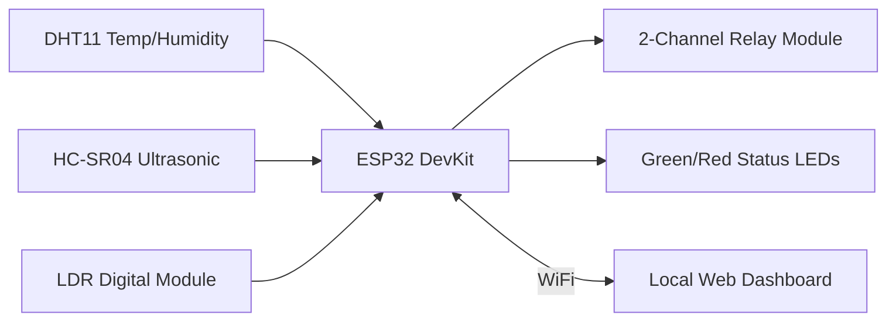
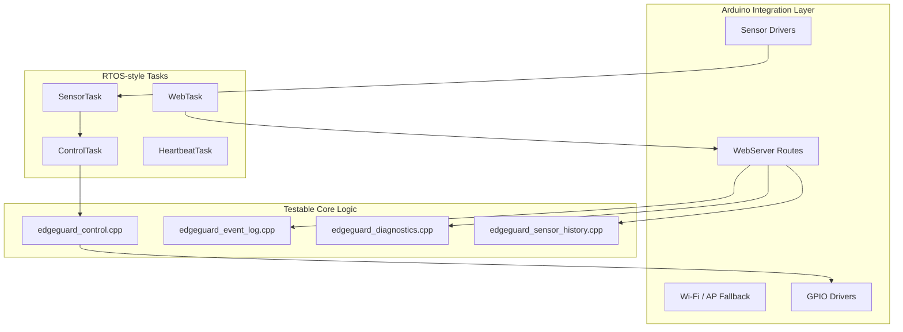
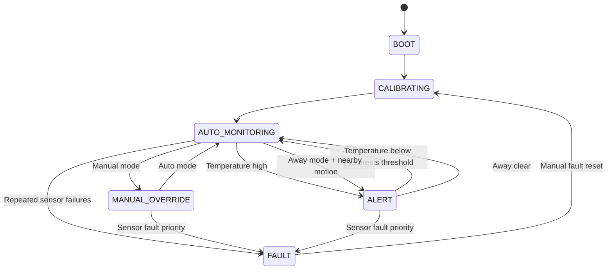

<div align="center">

# EdgeGuard ESP32 RTOS Smart Room Node

**Deterministic ESP32 smart-room monitoring and control firmware with RTOS-style tasking, local diagnostics, safe relay behavior, and host-tested control logic.**


</div>

> 🖼️ **IMAGE SLOT 01 — Hero build photo**  
> **File path:** `assets/photos/edgeguard_hero_build.jpg`  
> **Format:** JPG  
> **Recommended size:** 1600x900 or 1920x1080  
> **What to attach:** A clean front-facing photo of the complete ESP32 EdgeGuard hardware build, showing the ESP32 board, DHT11, HC-SR04, LDR module, relay module, LEDs, and low-voltage LED loads.

## Table of Contents
- [What EdgeGuard Does](#what-edgeguard-does)
- [Core Capabilities](#core-capabilities)
- [Hardware Used](#hardware-used)
- [Frozen GPIO Pin Map](#frozen-gpio-pin-map)
- [Wiring and Schematic Notes](#wiring-and-schematic-notes)
- [Firmware Architecture](#firmware-architecture)
- [State Machine](#state-machine)
- [RTOS-style Task Model](#rtos-style-task-model)
- [Web Dashboard](#web-dashboard)
- [HTTP API](#http-api)
- [Security Model](#security-model)
- [Diagnostics and Telemetry](#diagnostics-and-telemetry)
- [Sensor History](#sensor-history)
- [Local Setup](#local-setup)
- [Testing](#testing)
- [CI](#ci)
- [Serial Monitor](#serial-monitor)
- [Demo Evidence Checklist](#demo-evidence-checklist)
- [Safety](#safety)
- [Repository Structure](#repository-structure)
- [License](#license)

## What EdgeGuard Does
EdgeGuard runs on an ESP32 DevKit and reads a DHT11 temperature/humidity sensor, an HC-SR04 ultrasonic sensor, and an LDR digital light module. The firmware manages `AUTO`, `MANUAL`, `AWAY`, `ALERT`, and `FAULT` behavior, drives two relays for low-voltage LED loads only, and exposes a local web dashboard for state, telemetry, control, diagnostics, logs, and history. Host-side C++ tests validate deterministic control logic without hardware.

## Core Capabilities
| Capability | Purpose |
|---|---|
| Deterministic control state machine | Keeps mode, alert, occupancy, and fault behavior explicit and testable. |
| RTOS-style task decomposition | Separates sensing, control, web serving, and heartbeat signaling. |
| Local web dashboard | Provides same-network telemetry, controls, diagnostics, logs, and history. |
| Fault-safe relay handling | Forces both relay outputs off in `FAULT` and during fault reset. |
| Sensor failure detection | Tracks consecutive DHT11 and HC-SR04 failures. |
| Temperature hysteresis | Latches alert at the high threshold and clears at the low threshold. |
| Occupancy hold timeout | Keeps occupancy active briefly after the last nearby reading. |
| Runtime diagnostics | Reports uptime, reset reason, heap, Wi-Fi state, task health, and counters. |
| Task health monitoring | Tracks heartbeats, loop duration, jitter, and deadline misses. |
| API token protection | Protects local POST control routes when a token is configured. |
| Host-side testability | Builds pure C++ logic tests without ESP32 hardware. |
| Arduino compile CI | Verifies the Arduino sketch with `esp32:esp32:esp32` without upload. |

## Hardware Used
- ESP32 DevKit
- DHT11 temperature/humidity sensor
- HC-SR04 ultrasonic sensor with Echo voltage divider
- LDR digital light module
- 2-channel relay module
- Green heartbeat LED
- Red alert/fault LED
- Low-voltage LED loads only

## Frozen GPIO Pin Map
| Signal | ESP32 GPIO |
|---|---:|
| DHT11 DATA | GPIO 4 |
| HC-SR04 TRIG | GPIO 5 |
| HC-SR04 ECHO through voltage divider | GPIO 18 |
| LDR DO | GPIO 34 |
| Relay IN1 | GPIO 26 |
| Relay IN2 | GPIO 27 |
| Green heartbeat LED | GPIO 23 |
| Red alert/fault LED | GPIO 22 |

## Wiring and Schematic Notes


HC-SR04 Echo must be level-shifted before it reaches GPIO18:

```text
HC-SR04 ECHO 5V ---- R1 ----+---- ESP32 GPIO18
                             |
                             R2
                             |
                            GND
```

All modules share common GND so logic levels have the same reference.

> 🖼️ **IMAGE SLOT 02 — Wiring overview**  
> **File path:** `assets/photos/wiring_overview.jpg`  
> **Format:** JPG  
> **Recommended size:** 1600x1200  
> **What to attach:** A clear overhead photo showing all jumper wires and module connections.

> 🖼️ **IMAGE SLOT 03 — HC-SR04 voltage divider close-up**  
> **File path:** `assets/photos/hcsr04_voltage_divider_closeup.jpg`  
> **Format:** JPG or PNG  
> **Recommended size:** 1200x900  
> **What to attach:** Close-up of the resistor divider between HC-SR04 Echo and ESP32 GPIO18.

## Firmware Architecture


## State Machine


## RTOS-style Task Model
| Task | Purpose | Period | Priority | Core | Monitored by diagnostics |
|---|---|---:|---:|---:|---|
| SensorTask | Reads DHT11, HC-SR04, and LDR module. | 2000 ms | 2 | 1 | Yes |
| ControlTask | Runs control state machine and safe-output supervision. | 500 ms | 2 | 1 | Yes |
| WebTask | Handles dashboard and local API routes. | 10 ms loop delay | 1 | 0 | Yes |
| HeartbeatTask | Drives green/red status LEDs. | 1000/300/150 ms | 1 | 1 | Yes |

## Web Dashboard
The dashboard is self-contained and served by the ESP32. It includes status cards, local API token storage, control buttons, diagnostics, task health, history links, and severity-coded logs.

> 🖼️ **IMAGE SLOT 04 — Dashboard status page**  
> **File path:** `assets/screenshots/dashboard_status.png`  
> **Format:** PNG  
> **Recommended size:** 1600x900  
> **What to attach:** Screenshot of the main dashboard showing system state, mode, sensor values, relays, fault section, and event log.

> 🖼️ **IMAGE SLOT 05 — Diagnostics dashboard/API output**  
> **File path:** `assets/screenshots/diagnostics_dashboard.png`  
> **Format:** PNG  
> **Recommended size:** 1600x900  
> **What to attach:** Screenshot showing diagnostics data such as uptime, heap, task health, watchdog status, Wi-Fi status, and fault counters.

## HTTP API
GET endpoints are local read endpoints. POST control endpoints require an API token when `EDGEGUARD_API_TOKEN` is configured. Send the token as `X-EdgeGuard-Token: <token>`. For short local demos an empty token can be used, but a non-empty token is recommended.

| Method | Endpoint | Description |
|---|---|---|
| GET | `/` | Dashboard. |
| GET | `/api/status` | Current sensor, mode, relay, and fault state. |
| GET | `/api/logs` | Severity-coded event log. |
| GET | `/api/diagnostics` | Runtime diagnostics and task health. |
| GET | `/api/history` | Sensor history JSON. |
| GET | `/api/history.csv` | Sensor history CSV. |
| POST | `/api/mode/auto` | Select AUTO mode. |
| POST | `/api/mode/manual` | Select MANUAL mode. |
| POST | `/api/mode/away` | Select AWAY mode. |
| POST | `/api/relay1/on` | Turn Relay 1 on in MANUAL mode. |
| POST | `/api/relay1/off` | Turn Relay 1 off in MANUAL mode. |
| POST | `/api/relay2/on` | Turn Relay 2 on in MANUAL mode. |
| POST | `/api/relay2/off` | Turn Relay 2 off in MANUAL mode. |
| POST | `/api/fault/reset` | Clear fault counters and return through calibration. |

## Security Model
EdgeGuard is local-only. It has no cloud dependency, no committed real credentials, optional fallback AP credentials in `secrets.h`, and token-protected POST control routes. Normal dashboard use is same-origin, so wildcard CORS is not used for control routes. Relay control is scoped to low-voltage LED loads only.

## Diagnostics and Telemetry
`/api/diagnostics` reports uptime, reset reason, free heap, minimum free heap, Wi-Fi mode/status, task heartbeat counters, task deadline misses, jitter, sensor failure counters, active fault code, and watchdog status.

## Sensor History
The firmware keeps a fixed-size RAM ring buffer of recent samples. JSON and CSV exports support debugging and trace replay without an SD card.

## Local Setup
1. Install the ESP32 board package in Arduino IDE.
2. Install the DHT sensor library.
3. Install Adafruit Unified Sensor.
4. Copy `firmware/EdgeGuard_ESP32/secrets.h.example` to `firmware/EdgeGuard_ESP32/secrets.h`.
5. Configure `WIFI_SSID`, `WIFI_PASSWORD`, `EDGEGUARD_AP_SSID`, `EDGEGUARD_AP_PASSWORD`, and `EDGEGUARD_API_TOKEN`.
6. Open `firmware/EdgeGuard_ESP32/EdgeGuard_ESP32.ino` in Arduino IDE.
7. Select ESP32 Dev Module.
8. Upload.

## Testing
```bash
bash scripts/run_host_tests.sh
python3 scripts/validate_repo.py
python3 scripts/check_firmware_structure.py
```

## CI
GitHub Actions runs host tests, repository validation, firmware structure checks, formatting checks, and Arduino CLI compile for `esp32:esp32:esp32`. CI creates a temporary `secrets.h` for compile only and never uploads to hardware.

> 🖼️ **IMAGE SLOT 06 — CI pipeline passing**  
> **File path:** `assets/screenshots/github_actions_ci_passed.png`  
> **Format:** PNG  
> **Recommended size:** 1600x900  
> **What to attach:** Screenshot of GitHub Actions showing host tests, repository validation, firmware structure checks, and Arduino compile passing.

## Serial Monitor
> 🖼️ **IMAGE SLOT 07 — Serial monitor logs**  
> **File path:** `assets/screenshots/serial_monitor_runtime_logs.png`  
> **Format:** PNG  
> **Recommended size:** 1600x900  
> **What to attach:** Screenshot of Arduino Serial Monitor showing boot logs, Wi-Fi/AP information, sensor readings, state transitions, and event messages.

## Demo Evidence Checklist
- Dashboard over Wi-Fi or fallback AP
- AUTO mode dark + occupied behavior
- MANUAL relay control
- AWAY alert behavior
- FAULT mode after repeated sensor failure
- Fault reset
- Diagnostics endpoint
- History CSV export
- CI passing

## Safety
Relays are for low-voltage LED loads only. Do not use this documentation for AC mains wiring. HC-SR04 Echo must go through a divider before GPIO18. Common GND is required across modules.

## Repository Structure
```text
firmware/EdgeGuard_ESP32/      Arduino sketch, config, control, diagnostics, log, and history modules
hardware/wiring_table.md       Frozen wiring reference and safety notes
docs/                          Architecture, API, CI, timing, memory, testing, and failure-mode docs
tests/host_logic_tests/        C++17 host tests for pure firmware logic
scripts/                       Host test runner and validation scripts
assets/photos/                 Build photo placeholders
assets/screenshots/            Dashboard and CI screenshot placeholders
assets/diagrams/               Optional rendered diagram exports
```

## License
See [LICENSE](LICENSE).
