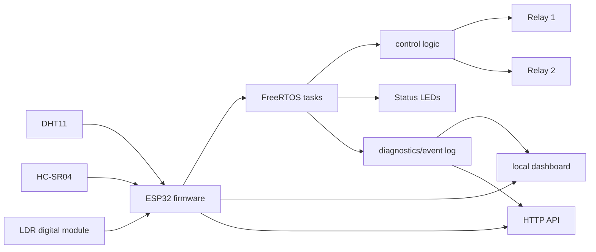
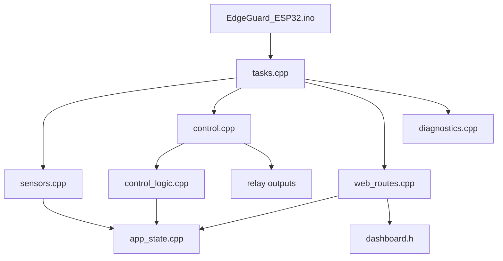
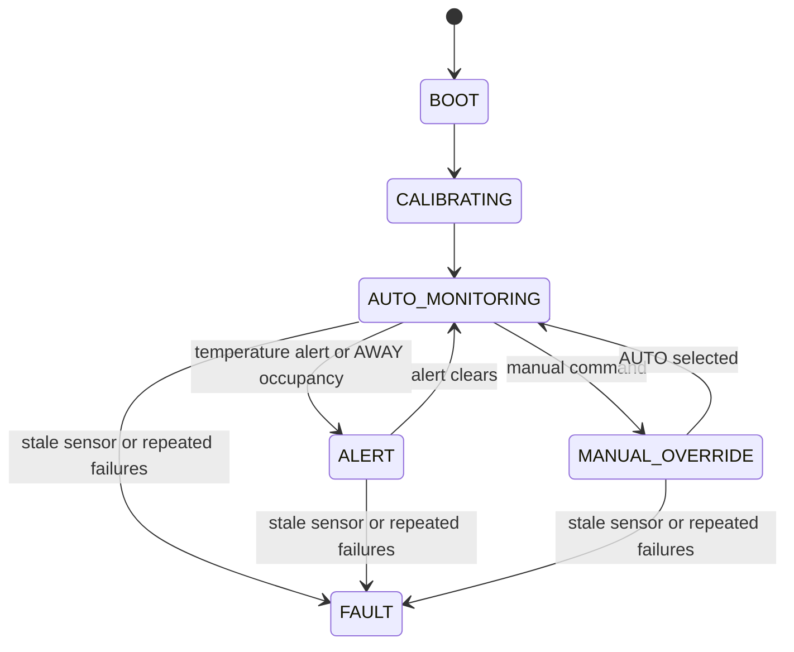
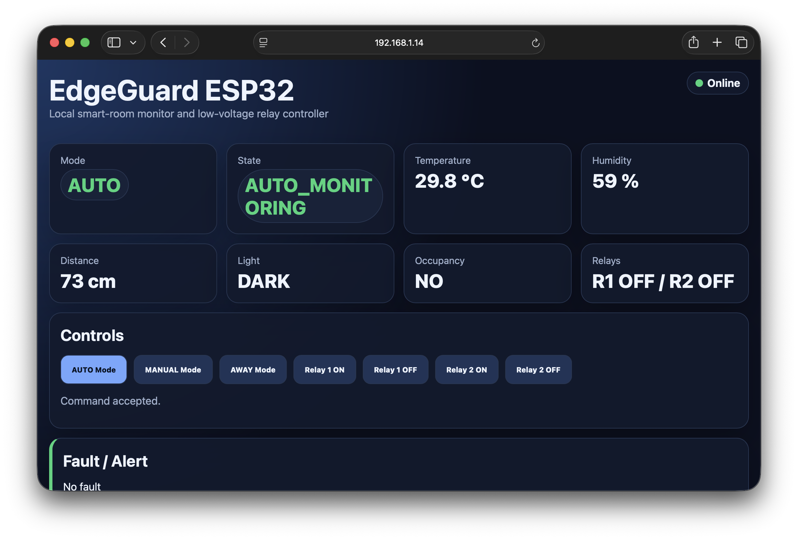
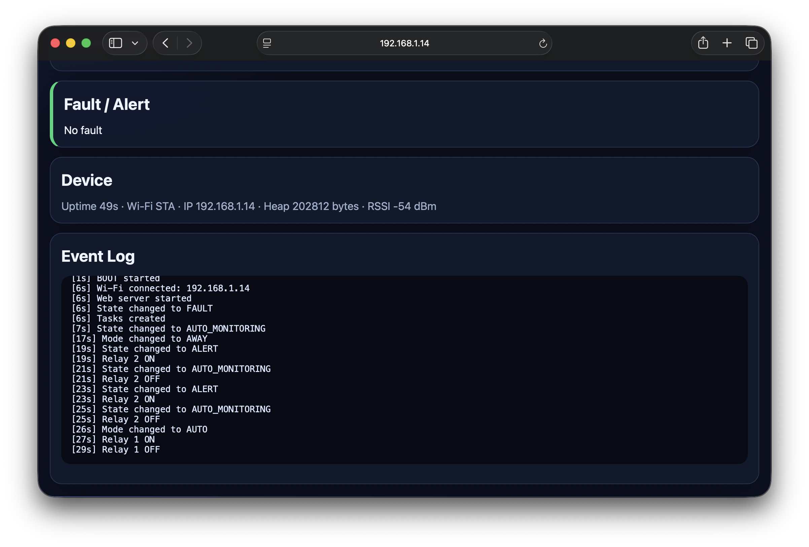
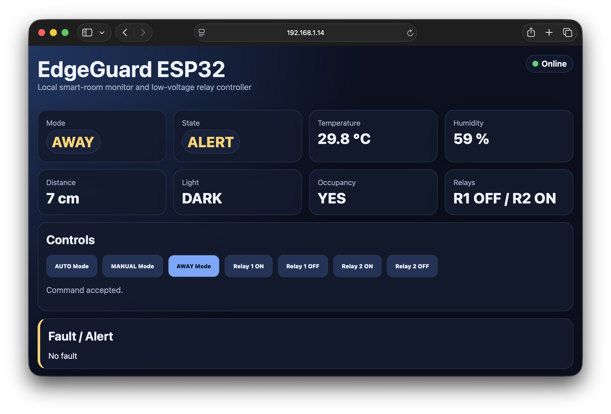
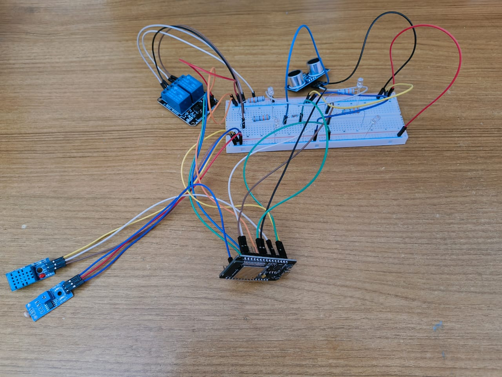
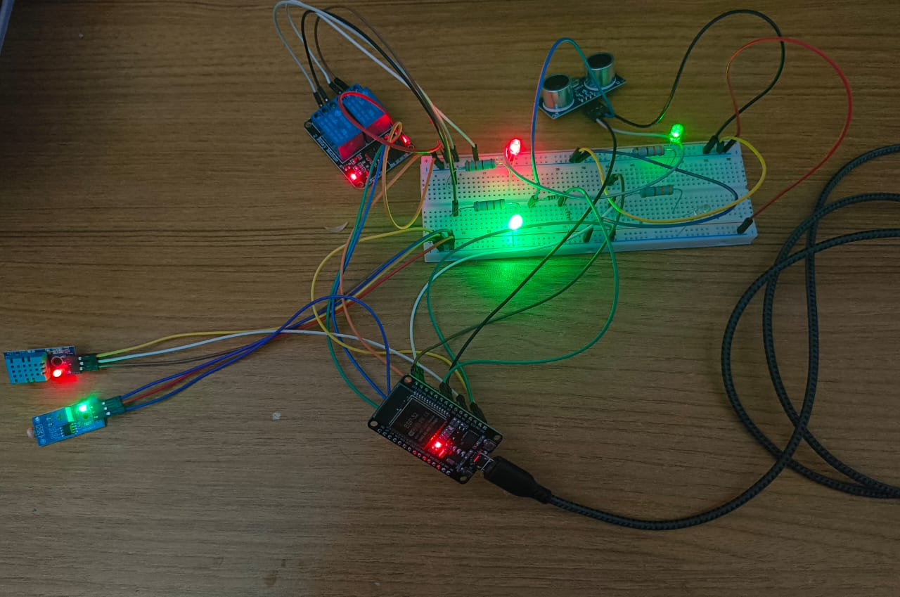
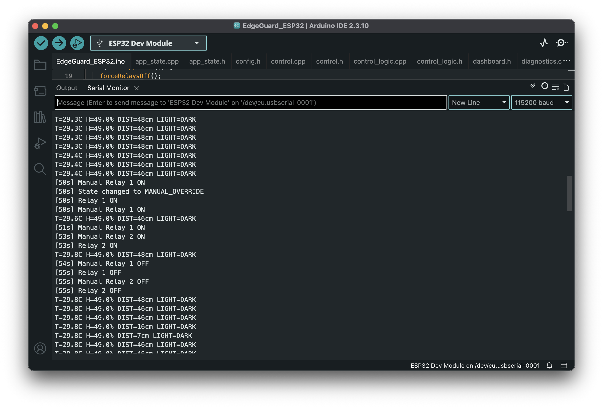

<div align="center">

# EdgeGuard ESP32

### Local-first ESP32 smart-room sensing, relay control, diagnostics, and onboard dashboard

EdgeGuard ESP32 is an Arduino-compatible ESP32 firmware project for low-voltage room sensing, deterministic relay decisions, a browser dashboard, a compact local HTTP API, diagnostics, and host-side control-logic tests.

<br/>

[](https://github.com/AyushmanRaha/EdgeGuard-ESP32/actions/workflows/ci.yml)


[](LICENSE)

<br/>

**Local dashboard. Local HTTP API. Low-voltage prototype. No cloud dependency.**

<p align="center">
  <a href="#what-edgeguard-does"><strong>Overview</strong></a> ·
  <a href="#quick-start"><strong>Quick Start</strong></a> ·
  <a href="#docs-and-deep-dives"><strong>Docs</strong></a> ·
  <a href="#http-api-quick-reference"><strong>API</strong></a> ·
  <a href="#safety-and-limitations"><strong>Safety</strong></a>
</p>

</div>

---

## Table of Contents

1. [What EdgeGuard does](#what-edgeguard-does)
2. [Why it is technically strong](#why-it-is-technically-strong)
3. [Architecture at a glance](#architecture-at-a-glance)
4. [Feature tour](#feature-tour)
5. [Hardware overview](#hardware-overview)
6. [Quick Start](#quick-start)
7. [Operating modes](#operating-modes)
8. [HTTP API quick reference](#http-api-quick-reference)
9. [Dashboard](#dashboard)
10. [Testing and CI](#testing-and-ci)
11. [Docs and deep dives](#docs-and-deep-dives)
12. [Project structure](#project-structure)
13. [Safety and limitations](#safety-and-limitations)
14. [Troubleshooting](#troubleshooting)
15. [License](#license)
16. [Acknowledgements](#acknowledgements)

---

## What EdgeGuard does

EdgeGuard runs on an ESP32 DevKit target and keeps room sensing, relay control, diagnostics, and local web access on the device. It is intended for low-voltage DC prototyping and local validation rather than cloud-connected automation.

| Function | Verified behavior |
| --- | --- |
| Temperature and humidity | Reads a DHT11 module. |
| Distance sensing | Reads an HC-SR04 ultrasonic module with ECHO protected for ESP32 GPIO levels. |
| Light sensing | Reads a digital LDR module and interprets dark/bright state from firmware polarity. |
| Relay outputs | Controls two low-voltage relay outputs. |
| Dashboard | Serves an onboard browser dashboard from `GET /`. |
| HTTP API | Exposes local status, logs, mode selection, and relay command routes. |
| Diagnostics | Tracks recent events, sensor failures, task heartbeats, reset reason, heap, Wi-Fi state, and watchdog status. |
| Tests | Runs host-side native tests for pure control logic without ESP32 hardware. |

## Why it is technically strong

| Capability | Technical behavior |
| --- | --- |
| Local-first ESP32 node | Dashboard and API are served by the ESP32; no cloud service is required for normal local operation. |
| FreeRTOS task separation | Sensor, control, web-client handling, and heartbeat loops are split into firmware tasks. |
| Pure control-logic seam | `control_logic.cpp` computes decisions from snapshots and retained memory without direct GPIO or network access. |
| Conservative relay fail-safe behavior | Stale sensor snapshots and verified repeated sensor-failure paths force both relay outputs off. |
| Sensor diagnostics and fault paths | DHT11 and HC-SR04 failures are counted and exposed through diagnostics and status JSON. |
| Onboard dashboard | The embedded dashboard displays mode, state, sensors, relays, network details, heap, and recent events. |
| Local HTTP API | Route set is intentionally small and stable; normal mode and relay commands return `{"ok":true}`. |
| Fallback Wi-Fi access point | If station credentials are absent, placeholders, or unavailable, firmware starts fallback AP mode. |
| Host-side native tests | PlatformIO native tests compile the pure control logic with Arduino/FreeRTOS stubs. |
| Repository verification script | `tools/verify_repo.py` checks required files, local documentation links, content guardrails, and credential placeholders. |

## Architecture at a glance

EdgeGuard keeps the Arduino sketch and sibling modules in `firmware/EdgeGuard_ESP32/` so the same source tree works with Arduino IDE and PlatformIO. The deeper design notes live in the [architecture guide](docs/architecture.md), [design rationale](docs/design_rationale.md), and [usage and implementation guide](docs/usage_implementation_guide.md).





## Feature tour

### Local dashboard

The dashboard at `GET /` polls the status and log APIs, shows current mode/state, sensor readings, relay states, Wi-Fi details, heap values, and recent events. See the [dashboard section](#dashboard) and [API documentation](docs/api.md).

### Sensor pipeline

Sensor tasks read the DHT11, HC-SR04, and digital LDR inputs, then publish shared snapshots for control and web routes. Wiring and electrical notes are in the [hardware guide](docs/hardware.md) and [wiring table](hardware/wiring_table.md).

### Relay control

Control logic evaluates current mode, occupancy, light state, temperature alert hysteresis, stale sensor data, and diagnostics faults before applying relay GPIO outputs. Mode behavior is summarized in [Operating modes](#operating-modes) and explained in the [design rationale](docs/design_rationale.md).

### Diagnostics and event log

Diagnostics expose sensor failure counters, task heartbeats, heap, reset reason, watchdog state, Wi-Fi reconnect state, and a bounded recent event log. The full response fields are documented in [docs/api.md](docs/api.md).

### Host-side tests

The native test environment compiles `control_logic.cpp` with stubs and verifies AUTO, MANUAL, AWAY, stale-sensor fault handling, occupancy hold, temperature hysteresis, invalid distance readings, and boundary behavior. See the [testing plan](docs/testing_plan.md).

## Hardware overview

Core parts are an ESP32 DevKit board, DHT11 sensor, HC-SR04 ultrasonic module with ECHO level shifted to 3.3 V, digital LDR module, two low-voltage relay channels, and red/green status LEDs.

| Function | ESP32 GPIO | Notes |
| --- | ---: | --- |
| DHT11 DATA | 4 | Temperature and humidity data. |
| HC-SR04 TRIG | 5 | ESP32 output. |
| HC-SR04 ECHO | 18 | Use a voltage divider or level shifter to protect the 3.3 V GPIO. |
| LDR DO | 34 | Digital input only. |
| Relay 1 | 26 | Active-low by default. |
| Relay 2 | 27 | Active-low by default. |
| Green LED | 23 | Normal heartbeat/status. |
| Red LED | 22 | Alert/fault indication. |

Firmware defaults in [`config.h`](firmware/EdgeGuard_ESP32/config.h) keep `RELAY_ACTIVE_LOW = true` and `LDR_DARK_WHEN_HIGH = true`. Use the [hardware guide](docs/hardware.md) and [wiring table](hardware/wiring_table.md) before wiring.

> Safety: this repository documents low-voltage DC prototyping only. Do not connect high-voltage loads to a breadboard or exposed relay module.

## Quick Start

1. **Clone or open this repository** on your development computer.
2. **Choose a workflow:** Arduino IDE with `firmware/EdgeGuard_ESP32/EdgeGuard_ESP32.ino`, or PlatformIO from the repository root.
3. **Optionally configure Wi-Fi:** copy `firmware/EdgeGuard_ESP32/secrets.h.example` to local, untracked `firmware/EdgeGuard_ESP32/secrets.h`; keep placeholders or omit the file to use fallback AP mode.
4. **Build and upload:** use Arduino IDE upload, or run `pio run -e esp32doit-devkit-v1 -t upload` with PlatformIO.
5. **Open Serial Monitor** at `115200` baud.
6. **Open the dashboard:** use the printed station IP, or connect to fallback AP `EdgeGuard-ESP32` with password `edgeguard123` and use the AP IP printed by the firmware.
7. **Read the full setup guide:** follow [docs/usage_implementation_guide.md](docs/usage_implementation_guide.md) for detailed build, validation, and adaptation steps.

## Operating modes

| Mode or state | Behavior |
| --- | --- |
| AUTO | Relay 1 follows dark-and-held-occupied logic; Relay 2 follows the temperature alert latch. |
| MANUAL | Pure logic sets `MANUAL_OVERRIDE` and preserves relay states; relay command helpers switch to MANUAL and directly apply the requested relay output. |
| AWAY | Relay 1 remains off; instant valid occupancy turns Relay 2 on and sets `ALERT`. |
| FAULT | Stale sensor data or verified repeated sensor failures force both relay outputs off. |



## HTTP API quick reference

The route set below matches `firmware/EdgeGuard_ESP32/web_routes.cpp`. Full status fields, response notes, and examples are in [docs/api.md](docs/api.md).

| Method | Route | Purpose |
| --- | --- | --- |
| GET | `/` | Dashboard. |
| GET | `/api/status` | Sensor, system, Wi-Fi, heap, and diagnostic status. |
| GET | `/api/logs` | Bounded event log as a JSON array. |
| POST | `/api/mode/auto` | Select AUTO mode. |
| POST | `/api/mode/manual` | Select MANUAL mode. |
| POST | `/api/mode/away` | Select AWAY mode. |
| POST | `/api/relay1/on` | Relay 1 on and MANUAL mode. |
| POST | `/api/relay1/off` | Relay 1 off and MANUAL mode. |
| POST | `/api/relay2/on` | Relay 2 on and MANUAL mode. |
| POST | `/api/relay2/off` | Relay 2 off and MANUAL mode. |

## Dashboard

The local dashboard is served from `/` by the ESP32. It polls the status and log APIs, shows current mode/state, sensor readings, relay states, network details, heap information, and recent events, then provides buttons for mode and relay commands.

### Dashboard screenshots







### Prototype images





### Serial monitor validation

The Arduino IDE Serial Monitor screenshot below shows live EdgeGuard telemetry at `115200` baud, including DHT11 temperature/humidity readings, HC-SR04 distance readings, LDR state, manual relay commands, relay ON/OFF events, and the transition into `MANUAL_OVERRIDE`.

[](media/serial-monitor-manual-relay-validation.png)

*Click the image to open the full-size serial monitor validation screenshot.*

## Testing and CI

Run these automated checks from the repository root:

```bash
python tools/verify_repo.py
pio test -e native
pio run -e esp32doit-devkit-v1
```

Native tests cover AUTO, MANUAL, AWAY, stale-sensor fault handling, occupancy hold, temperature hysteresis, invalid distance readings, and boundary behavior in `computeControlDecision(...)`. CI runs repository verification, native tests, the ESP32 firmware build, and uploads firmware artifacts. See the [testing plan](docs/testing_plan.md) and [CI details](docs/ci.md).

## Docs and deep dives

| Document | What it covers |
| --- | --- |
| [Usage and Implementation Guide](docs/usage_implementation_guide.md) | Chronological setup, build, flashing, validation, and adaptation workflow. |
| [Architecture](docs/architecture.md) | Firmware modules, data flow, task split, shared state, diagnostics, and web serving. |
| [HTTP API](docs/api.md) | Routes, response fields, command behavior, and curl examples. |
| [Development](docs/development.md) | Local development workflow, Arduino IDE notes, and change guidelines. |
| [Hardware](docs/hardware.md) | Parts, pin map, electrical constraints, relay polarity, and validation notes. |
| [CI](docs/ci.md) | GitHub Actions workflow, trigger events, commands, caching, and artifacts. |
| [Testing Plan](docs/testing_plan.md) | Automated checks and manual validation checklist. |
| [Design Rationale](docs/design_rationale.md) | Reasoning behind local-first operation, task boundaries, control seams, and fail-safe choices. |
| [Troubleshooting](docs/troubleshooting.md) | Common upload, Wi-Fi, sensor, API, relay, and serial monitor issues. |
| [Wiring Table](hardware/wiring_table.md) | Concise module-to-GPIO wiring reference. |

## Project structure

| Path | Purpose |
| --- | --- |
| `firmware/EdgeGuard_ESP32/` | Arduino-compatible firmware modules and embedded dashboard. |
| `hardware/wiring_table.md` | Concise wiring reference for the verified prototype pin map. |
| `docs/` | Architecture, API, hardware, testing, CI, rationale, troubleshooting, and usage docs. |
| `test/native_stubs/` | Minimal Arduino/FreeRTOS stubs for host-side native tests. |
| `test/test_control_logic/` | Unity tests for pure control logic. |
| `tools/verify_repo.py` | Repository integrity, local-link, content-policy, and credential checks. |
| `.github/workflows/ci.yml` | Verification, native test, firmware build, and artifact workflow. |
| `platformio.ini` | ESP32 and native PlatformIO environments. |

For deeper navigation, start with the [usage guide](docs/usage_implementation_guide.md) and [architecture guide](docs/architecture.md).

## Safety and limitations

- Low-voltage DC prototyping only.
- No cloud dependency is implemented or required for local operation.
- No built-in authentication; use trusted lab or isolated local networks.
- Do not expose the ESP32 dashboard/API directly to untrusted networks.
- Do not commit real Wi-Fi credentials, tokens, API keys, or passwords.
- The documented relay outputs are for safe low-voltage loads only; no mains AC wiring instructions are provided.

## Troubleshooting

Start with [docs/troubleshooting.md](docs/troubleshooting.md) for upload, Wi-Fi, dashboard/API, sensor, relay, and serial-monitor checks. For wiring-specific issues, cross-check the [hardware guide](docs/hardware.md) and [wiring table](hardware/wiring_table.md).

## License

This project is licensed under the [MIT License](LICENSE).

## Acknowledgements

EdgeGuard uses the Arduino ESP32 ecosystem, PlatformIO, Unity native testing through PlatformIO, and the DHT sensor libraries declared in `platformio.ini`.
