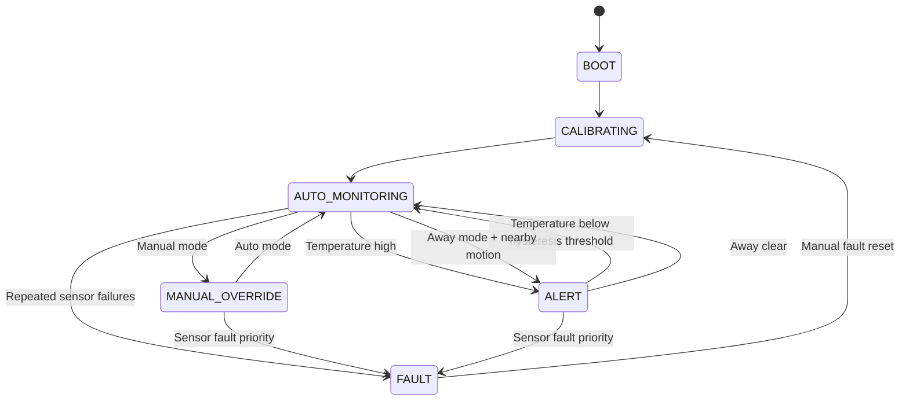

# State Machine

Priority order: software watchdog fault, repeated sensor faults, manual mode, away alert, temperature alert, normal automatic monitoring. Temperature alert uses hysteresis: latch at `TEMP_ALERT_ON_C`, clear at `TEMP_ALERT_OFF_C`. Occupancy is held until `UNOCCUPIED_TIMEOUT_MS` after the last nearby HC-SR04 reading.

Manual fault reset clears counters, clears watchdog state, turns relays off, and returns through calibration. FAULT always forces both relay outputs off.
